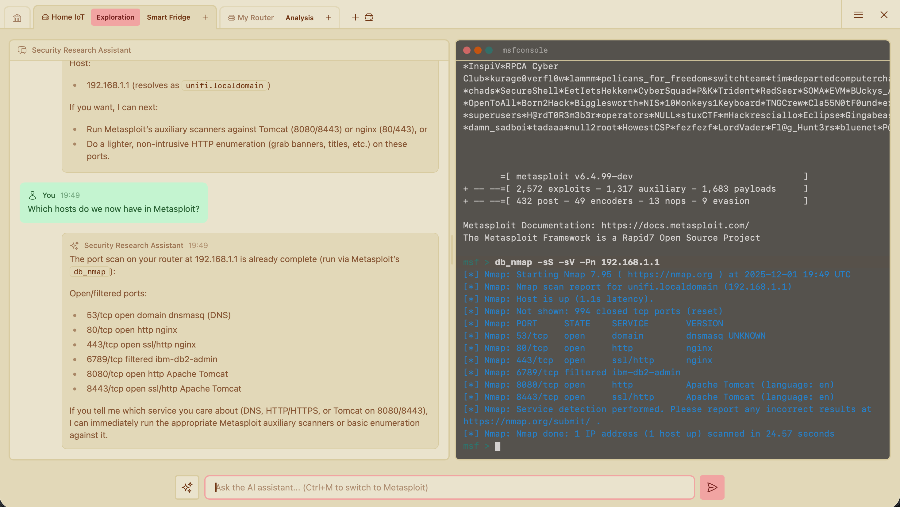

# Metasploit Framework AI Lab

**Collaborative security research platform where humans and AI agents work side by side.**

> **Early Development Notice:** This project is in early development and will undergo frequent, drastic changes. Feedback is very welcome! Due to the rapid pace of changes, I recommend submitting bug reports and feature requests rather than pull requests until the codebase stabilizes.

## What is msfailab?

msfailab is a platform for security research teams that orchestrates multiple Metasploit Framework environments through a shared web interface. It treats AI agents as first-class research partners—giving them the same console access and workspace visibility as human researchers.

Your team and your AI agents work together on the same research tracks, share the same knowledge base, and build on each other's findings.



## Core Capabilities

### Workspaces & Tracks

Organize your research into **workspaces**—isolated environments for different engagements, projects, or clients. Within each workspace, spin up as many **research tracks** as you need. Each track provides a dedicated Metasploit console, shell access, and AI assistant. Researchers—human or AI—can have their own tracks, or multiple team members can collaborate on the same one. Parallelize your research across targets, techniques, or investigation threads without stepping on each other.

### Human + AI Collaboration

AI agents aren't observers. They have full access to each track's Metasploit console and shell, and can execute commands, analyze results, and drive research forward. You work with AI agents the same way you work with teammates: sharing tracks, discussing findings, and dividing up work. The agents see what you see and can act on it.

### Shared Knowledge Base

Everything flows into a unified database: hosts, services, vulnerabilities, credentials, loot. But msfailab goes further—researchers and agents accumulate notes and gathered knowledge over time. This persistent context means your AI agents understand the project history. They know what's been tried, what's been found, and what matters. Your research builds on itself.

### Web-Based Team Interface

A real-time web UI gives everyone visibility into all research activities. See active tracks across workspaces, review shared findings, and collaborate without context-switching between terminals and chat windows.

## Quick Start

msfailab requires Docker and at least one AI backend configured. See [DEPLOYMENT.md](DEPLOYMENT.md) for full deployment options including macOS support.

### Linux (Recommended)

```bash
# Create configuration file (at least one AI backend required)
cat > msfailab.conf << 'EOF'
MSFAILAB_OLLAMA_HOST=http://localhost:11434
# MSFAILAB_OPENAI_API_KEY=sk-...
# MSFAILAB_ANTHROPIC_API_KEY=sk-ant-...
EOF

# Load configuration and start msfailab
set -a && source msfailab.conf && set +a
docker compose -f oci://ghcr.io/sarnowski/msfailab-linux:latest up -d
```

To update to the latest version, add `--pull always`:

```bash
docker compose -f oci://ghcr.io/sarnowski/msfailab-linux:latest up -d --pull always
```

Open http://localhost:4000 in your browser.

For a full configuration template with all options, download [msfailab.conf.example](https://github.com/sarnowski/msfailab/blob/main/msfailab.conf.example).

### macOS

macOS users should use the macOS-specific compose file due to Docker Desktop networking limitations:

```bash
# Load configuration and start msfailab
set -a && source msfailab.conf && set +a
docker compose -f oci://ghcr.io/sarnowski/msfailab-macos:latest up -d
```

To update to the latest version, add `--pull always`:

```bash
docker compose -f oci://ghcr.io/sarnowski/msfailab-macos:latest up -d --pull always
```

**Note:** Reverse shells don't work on macOS due to Docker Desktop limitations. See [DEPLOYMENT.md](DEPLOYMENT.md) for details.

### Development Setup

```bash
git clone https://github.com/sarnowski/msfailab.git
cd msfailab

# Start dependencies (use compose.macos.dev.yaml on macOS)
docker compose -f compose.linux.dev.yaml up --build -d

# Configure AI backend (at least one required)
cp msfailab.conf.example .env
# Edit .env with your API keys
mix setup

# Run
mix phx.server
```

Open http://localhost:4000 in your browser.

## Configuration

All configuration is done via environment variables. See [msfailab.conf.example](msfailab.conf.example) for a complete template with all options documented.

### AI Backends (at least one required)

| Variable | Description |
|----------|-------------|
| `MSFAILAB_OLLAMA_HOST` | Ollama API endpoint (e.g., `http://localhost:11434`) |
| `MSFAILAB_OPENAI_API_KEY` | OpenAI API key |
| `MSFAILAB_ANTHROPIC_API_KEY` | Anthropic API key |

### Model Filtering (optional)

| Variable | Default | Description |
|----------|---------|-------------|
| `MSFAILAB_OLLAMA_MODEL_FILTER` | `*` | Glob pattern for Ollama models |
| `MSFAILAB_OPENAI_MODEL_FILTER` | `gpt-5*` | Glob pattern for OpenAI models |
| `MSFAILAB_ANTHROPIC_MODEL_FILTER` | `claude-opus-4*,claude-sonnet-4*` | Glob pattern for Anthropic models |
| `MSFAILAB_DEFAULT_MODEL` | `*` | Default model selection pattern |
| `MSFAILAB_OLLAMA_THINKING` | `true` | Enable thinking mode for supported models |

### Server & Docker (optional)

| Variable | Default | Description |
|----------|---------|-------------|
| `MSFAILAB_PORT` | `127.0.0.1:4000` | Port binding (use `0.0.0.0:4000` for external access) |
| `MSFAILAB_HOST` | `localhost` | Public hostname for URL generation |
| `MSFAILAB_DOCKER_ENDPOINT` | `/var/run/docker.sock` | Docker socket path |
| `MSFAILAB_DEFAULT_CONSOLE_IMAGE` | `msfailab-msfconsole` | Custom MSF console image |

### Security (required for production)

| Variable | Default | Description |
|----------|---------|-------------|
| `MSFAILAB_SECRET_KEY_BASE` | (insecure default) | Secret for signing cookies/tokens |

For any non-demo deployment, you **must** generate a secure secret key:

```bash
# Generate a secure secret
openssl rand -base64 48

# Add to your .env file
echo "MSFAILAB_SECRET_KEY_BASE=<generated-value>" >> .env
```

If you change this value, all active sessions will be invalidated and users will need to log in again.

When deploying behind a reverse proxy with a public domain, also set:

```bash
echo "MSFAILAB_HOST=msfailab.example.com" >> .env
```

## Trust Model

msfailab is built for security research teams that trust each other. There is no built-in authentication or authorization—all team members have equal access to all workspaces, tracks, and data.

If you need user identification, deploy an authentication proxy in front of msfailab. The tool itself stays simple and assumes a trusted environment but takes your proxy's user information for audit logs.

## Trademarks

Metasploit and Metasploit Framework are trademarks of Rapid7, Inc. This project is not affiliated with, endorsed by, or sponsored by Rapid7.

## License

Copyright (C) 2025 Tobias Sarnowski

This program is free software: you can redistribute it and/or modify it under the terms of the GNU Affero General Public License as published by the Free Software Foundation, either version 3 of the License, or (at your option) any later version.

This program is distributed in the hope that it will be useful, but WITHOUT ANY WARRANTY; without even the implied warranty of MERCHANTABILITY or FITNESS FOR A PARTICULAR PURPOSE. See the GNU Affero General Public License for more details.

You should have received a copy of the GNU Affero General Public License along with this program. If not, see <https://www.gnu.org/licenses/>.

See [LICENSE.md](LICENSE.md) for the full license text.
